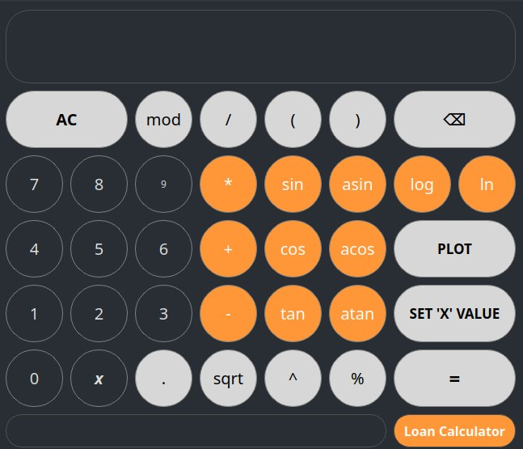

# SmartCalcV2.0

SmartCalcV2.0 is an advanced calculator application developed using C++ and the Qt framework. The project leverages the Model-View-Controller (MVC) architectural pattern and supports reverse Polish notation (RPN) for efficient and powerful mathematical calculations.

## Features

- Calculator functionality based on reverse Polish notation (RPN) for accurate and streamlined mathematical computations.

- Utilizes the Model-View-Controller (MVC) design pattern to separate concerns and enhance maintainability and extensibility of the codebase.

- User-friendly graphical interface developed using Qt, providing a seamless and intuitive experience for users.

- Supports a wide range of mathematical operations, including basic arithmetic, trigonometric functions, logarithms, and more.

## Installation

1. Clone the repository:
```sh
git clone https://github.com/zenorachi/SmartCalcV2.0.git
```
2. Build and compile the project:
```sh
make
```
or
```sh
make install
```
3. Open the application:
```sh
make open
```
or
```sh
cd ./app && ./SmartCalcV2.0
```
4. Enjoy:

